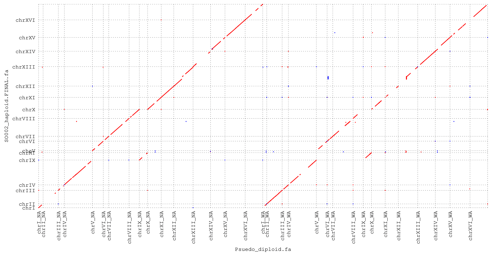
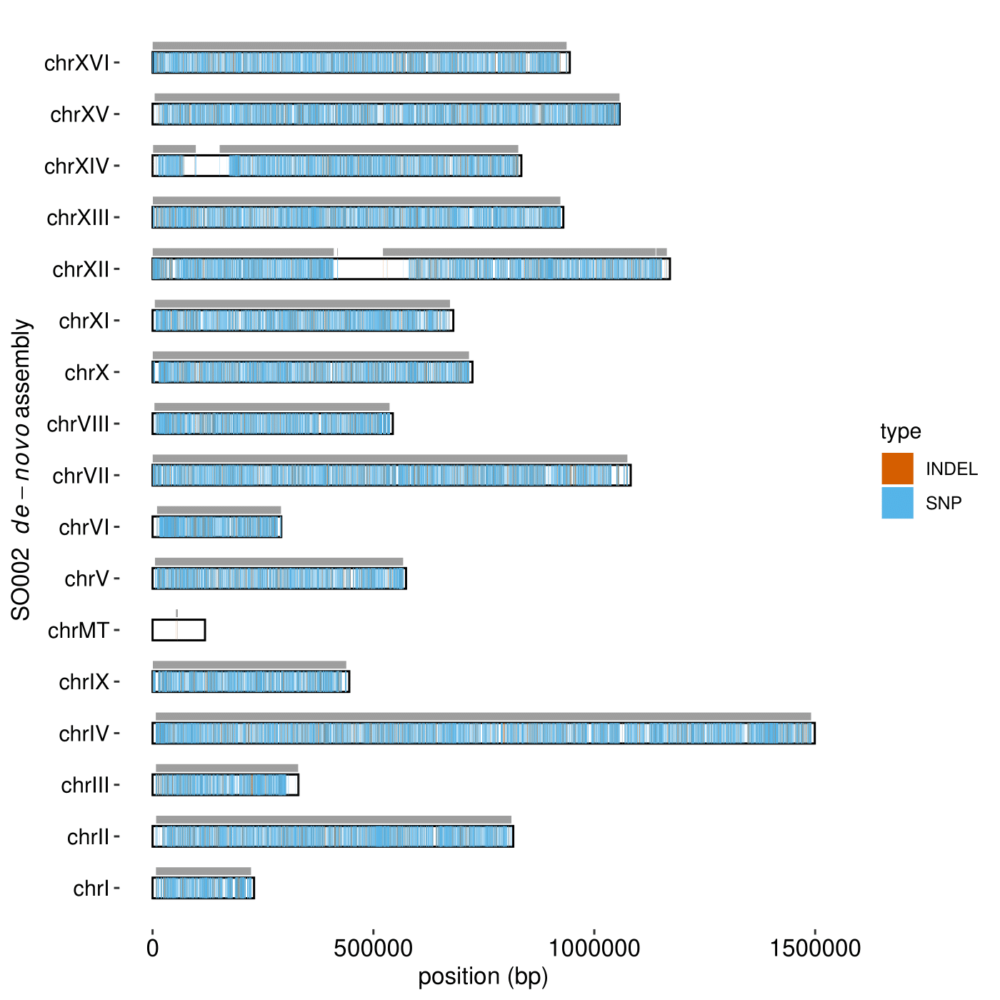
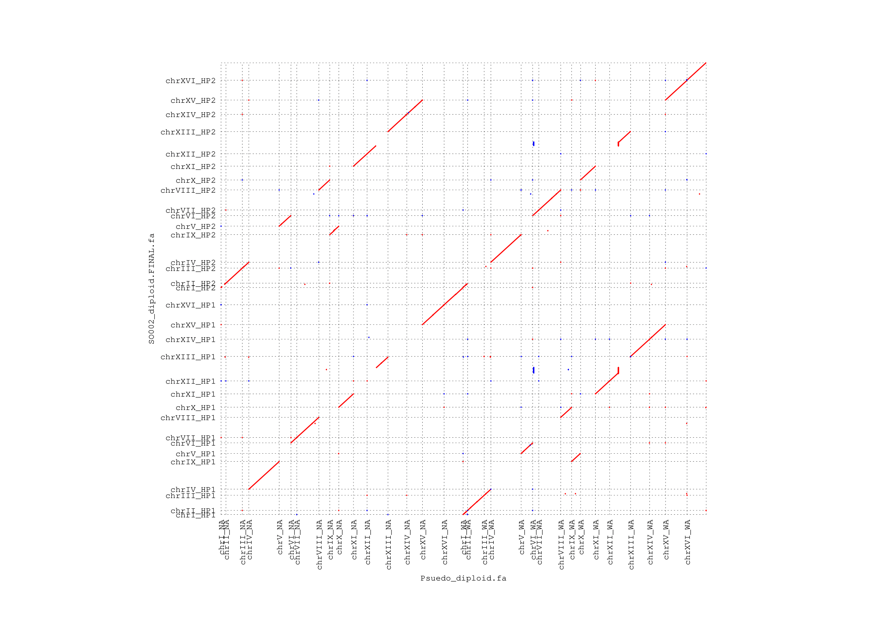

# **PHASED DIPLOID GENOME ASSEMBLY PIPELINE**  
This pipeline is designed to take Long-read and illumina sequencing data of a heterozygous diploid and provide a phased diploid assembly  
This has been tested on *S.cerevisiae* with nanopore data
It appears to work well with strains containing at least 0.2% heterozygosity, an average long-read length of 8kb and >60X coverage.  
**_NOTE: Example commands below use S.cerevisiae and nanopore specifications if required by the tool_**  
**_NOTE: All tools/commands used or suggested are easy to install and use on a linux distibution_**  
The test data (strain SO002) comes from a cross between stable haploids YLF161 and YLF132 (https://doi.org/10.1002/yea.2991) from West African (DVBPG6044) and North American (YPS128) backgrounds respectively  
Both parents have reference quality assemblies for comparison (https://doi.org/10.1038/ng.3847)

Provided in the google drive folder below are nanopore reads (long_reads.fq.gz), basecalled by guppy (v3.4.5) and with adapter and barcodes removed using porechop  
https://drive.google.com/drive/folders/1IkuQMK5FLbndHcrX8vhoCPzKWePJleAl?usp=sharing  
176,003 reads  
106X coverage  
4,402 median length  
7,277 mean length  
12,519 N50  
and illumina data (illumina_1.fq.gz and illumina_2.fq.gz)

The essential pipeline has 10 steps:  
1. *De-novo* genome assembly using long-reads  
2. Genome polishing using long (Racon and Medaka) and short (Pilon) reads  
2.5 RECOMMENDED STEP: Scaffolding, negative-gap closing and extra contig purging  
3. Alignment of long-reads to assembly to generate bam file  
4. Variant calling using illumina reads to generate a vcf containing heterozygous variants  
5. Input of bam and vcf into whatshap to phase variants  
6. Input of bam and phased-vcf into whathap to phase reads  
7. Assessing phasing results through custom R script and statistics such as v90  
8. Arbitrarily combining blocks and unphased reads to generate haplotypes read sets  
9. *De-novo* assembly and long-read polishing of each haplotype seperately  
10. Illumina read polishing of diploid genome  
10.5 RECOMMENDED STEP AGAIN: Scaffolding, negative-gap closing and extra contig purging  

## **1. *De-novo* genome assembly using long-reads**  
The assembler of choice is at to your discretion.  
For this example I will use canu (best results with latest, at the time, version v2) at is has proved to work very well in the case of *S.cerevisiae*  
    
	##downsample entire reads to 40x using filtlong, selecting for the longest reads and removing any reads shorter than 1kb
	filtlong long_reads.fq.gz --length_weight 10 --min_length 1000 -t 480000000 | gzip > ./long_reads_fl.fq.gz
	## Canu assembly
	# predicted assembly size is based on the haploid genome size of S.cerevisiae
	canu -p SO002 \
		-d SO002_haploid_canu_dir \
		genomeSize=12m \
		useGrid=false \
		-nanopore long_reads_fl.fq.gz
	# assembly is in SO002_haploid_canu_dir/SO002_haploid.contigs.fasta
	mv SO002_haploid_canu_dir/SO002_haploid.contigs.fasta ./SO002_haploid.canu.fa

## **2. Genome polishing using long and short reads**  
This is only a recommended polishing scheme  
After benchmarking different polishing schemes with a variety of assemblers on *S. cerevisiae*, those with read correction steps benefitted most from 1xRacon-2xMedaka-3xPilon  
Assemblers without read-correction benefit from two more additional rounds of Racon  

	## 1 round of racon poloshing
	# minimap mapping first
	minimap2 -ax map-ont SO002_haploid.canu.fa long_reads.fq.gz > SO002_haploid.sam
	# feed sam file into racon
	racon long_reads.fq.gz SO002_haploid.sam SO002_haploid.canu.fa > SO002_haploid.canu_r1.fa
	# clean up, remove sam file
	rm SO002_haploid.sam
	
	## 2 rounds of Medaka Polishing
	# may need to change model (-m) depending on organism
	medaka_consensus -i long_reads.fq.gz -d SO002_haploid.canu_r1.fa -o SO002_haploid.canu_r1_m1 -v -m r941_min_high_g351
	# get polished genome
	mv SO002_haploid.canu_r1_m1/consensus.fasta ./SO002_haploid.canu_r1_m1.fa
	# clean up, remove other medaka output
	rm -r SO002_haploid.canu_r1_m1/
	# repeat for second round of polishing using new polished genome as input
	medaka_consensus -i long_reads.fq.gz -d SO002_haploid.canu_r1_m1.fa -o SO002_haploid.canu_r1_m2 -v -m r941_min_high_g351
	mv SO002_haploid.canu_r1_m2/consensus.fasta ./SO002_haploid.canu_r1_m2.fa
	rm -r SO002_haploid.canu_r1_m2/
	# clean up, remove index files
	rm *.mmi
	rm *.fai
	
	## 3 rounds of Pilon
	# indexing of genome to polish   
	bwa index SO002_haploid.canu_r1_m2.fa
	picard CreateSequenceDictionary R= SO002_haploid.canu_r1_m2.fa O= SO002_haploid.canu_r1_m2.dict
	samtools faidx SO002_haploid.canu_r1_m2.fa
	# mapping of illumina to long-read polished genome to generate a bam file
	bwa mem SO002_haploid.canu_r1_m2.fa illumina_1.fq.gz illumina_2.fq.gz | samtools sort -o SO002_haploid.bwamem.sorted.bam -
	# add some read groups
	gatk AddOrReplaceReadGroups \
	-I SO002_haploid.bwamem.sorted.bam \
	-O SO002_haploid.bwamem.sorted_RG.bam \
	--RGID SO002 --RGPL ILLUMINA --RGSM SO002 --RGLB 1 --RGPU 1
	# remove duplicates using GATK4
	gatk MarkDuplicatesSpark \
	-I SO002_haploid.bwamem.sorted_RG.bam \
	-O SO002_haploid.bwamem.sorted_RG_markdup.bam \
	--create-output-bam-index \
	--remove-all-duplicates TRUE
	# clean up,remove older bams
	rm SO002_haploid.bwamem.sorted.bam
	rm SO002_haploid.bwamem.sorted_RG.bam
	# provide bam and long-read polished assembly to pilon
	pilon \
	--genome SO002_haploid.canu_r1_m2.fa \
	--bam SO002_haploid.bwamem.sorted_RG_markdup.bam  \
	--fix snps,indels --vcf --changes --output SO002_haploid.pilon
	# clean up, remove pilon output, genome indexes, previous bam files and change name of polished genome file
	rm SO002_haploid.pilon.changes
	rm SO002_haploid.pilon.vcf
	rm SO002_haploid.canu_r1_m2.fa.*
	rm SO002_haploid.canu_r1_m2.dict
	rm SO002_haploid.bwamem.sorted_RG_markdup.ba*
	mv SO002_haploid.pilon.fasta SO002_haploid.canu_r1_m2_p1.fa
	# repeat polishing steps 2 more times
	bwa index SO002_haploid.canu_r1_m2_p1.fa
	picard CreateSequenceDictionary R= SO002_haploid.canu_r1_m2_p1.fa O= SO002_haploid.canu_r1_m2_p1.dict
	samtools faidx SO002_haploid.canu_r1_m2_p1.fa
	bwa mem SO002_haploid.canu_r1_m2_p1.fa illumina_1.fq.gz illumina_2.fq.gz | samtools sort -o SO002_haploid.bwamem.sorted.bam -
	gatk AddOrReplaceReadGroups \
	-I SO002_haploid.bwamem.sorted.bam \
	-O SO002_haploid.bwamem.sorted_RG.bam \
	--RGID SO002 --RGPL ILLUMINA --RGSM SO002 --RGLB 1 --RGPU 1
	gatk MarkDuplicatesSpark \
	-I SO002_haploid.bwamem.sorted_RG.bam \
	-O SO002_haploid.bwamem.sorted_RG_markdup.bam \
	--create-output-bam-index \
	--remove-all-duplicates TRUE
	rm SO002_haploid.bwamem.sorted.bam
	rm SO002_haploid.bwamem.sorted_RG.bam
	#provide bam and long-read polished assembly to pilon
	pilon \
	--genome SO002_haploid.canu_r1_m2_p1.fa \
	--bam SO002_haploid.bwamem.sorted_RG_markdup.bam  \
	--fix snps,indels --vcf --changes --output SO002_haploid.pilon 
	rm SO002_haploid.pilon.changes
	rm SO002_haploid.pilon.vcf
	rm SO002_haploid.canu_r1_m2_p1.fa.*
	rm SO002_haploid.canu_r1_m2_p1.dict
	rm SO002_haploid.bwamem.sorted_RG_markdup.ba*
	mv SO002_haploid.pilon.fasta SO002_haploid.canu_r1_m2_p2.fa
	# third and final round
	bwa index SO002_haploid.canu_r1_m2_p2.fa
	picard CreateSequenceDictionary R= SO002_haploid.canu_r1_m2_p2.fa O= SO002_haploid.canu_r1_m2_p2.dict
	samtools faidx SO002_haploid.canu_r1_m2_p2.fa
	bwa mem SO002_haploid.canu_r1_m2_p2.fa illumina_1.fq.gz illumina_2.fq.gz | samtools sort -o SO002_haploid.bwamem.sorted.bam -
	gatk AddOrReplaceReadGroups \
	-I SO002_haploid.bwamem.sorted.bam \
	-O SO002_haploid.bwamem.sorted_RG.bam \
	--RGID SO002 --RGPL ILLUMINA --RGSM SO002 --RGLB 1 --RGPU 1
	gatk MarkDuplicatesSpark \
	-I SO002_haploid.bwamem.sorted_RG.bam \
	-O SO002_haploid.bwamem.sorted_RG_markdup.bam \
	--create-output-bam-index \
	--remove-all-duplicates TRUE
	rm SO002_haploid.bwamem.sorted.bam
	rm SO002_haploid.bwamem.sorted_RG.bam
	pilon \
	--genome SO002_haploid.canu_r1_m2_p2.fa \
	--bam SO002_haploid.bwamem.sorted_RG_markdup.bam  \
	--fix snps,indels --vcf --changes --output SO002_haploid.pilon 
	rm SO002_haploid.pilon.changes
	rm SO002_haploid.pilon.vcf
	rm SO002_haploid.canu_r1_m2_p2.fa.*
	rm SO002_haploid.canu_r1_m2_p2.dict
	rm SO002_haploid.bwamem.sorted_RG_markdup.ba*
	# et viola, the polished assembly
	mv SO002_haploid.pilon.fasta SO002_haploid.canu_r1_m2_p3.fa

### **2.5 RECOMMENDED STEP: Scaffolding, negative-gap closing and extra contig purging**  
This step is to connect contigs that may be 'phased-over', by scaffolding and/or removing contig overlaps which may represent haplotype differences or errors  
Additionally, depending on your assembly, some small haplotigs may have already been generated. With canu this commonly occur, particularily around heterozygous SVs. Therefore scaffolding against a reference can simplify the process of removing haplotigs  
A simple referencing scaffolding procedure uses ragout, RaGOO or RagTag and a repeat masked reference genome  
Although tools like RaGOO and RagTag are much faster due to their use of minimap alignment, for a genome the size of cerevisiae, ragout is my choice  
This is mainly as RaGOO and RagTag generally overassemble (scaffolding small haplotigs to the main contig) and I cannot see how to stop it... 

	##ragout example
	#create recipe file with names of reference prefix, new assembly prefix, reference assembly, new assembly, prefix of genome for scaffold names
	echo "./reference = ref" > ragout.recipe
	echo "target = SO002_haploid" >> ragout.recipe
	echo "ref.fasta = S288c.masked.fa" >> ragout.recipe
	echo "SO002_haploid.fasta = SO002_haploid.canu_r1_m2_p3.fa" >> ragout.recipe
	echo ".naming_ref = ref" >> ragout.recipe
	#run ragout
	ragout -o SO002_haploid_ragout --solid-scaffolds ragout.recipe
	cat  SO002_haploid_ragout/SO002_haploid_scaffolds.fasta SO002_haploid_ragout/SO002_haploid_unplaced.fasta > SO002_haploid.canu_polished_scaffolded.fa
	# clean up, remove ragout output file
	rm -r SO002_haploid_ragout/
	## check scaffolding against reference using dotplot (an easy sway to do this is using a tool called D-GENIES) in order to see scaffolding results
	# make sure that all the reference is covered in the renamed and orientated contigs as we want to remove haplotigs and reduce assembly to complete haploid merged assembly
	## select only the scaffolds/contigs associated with the reference by name (this assembly is within the google drive folder)
	cat SO002_haploid.canu_polished_scaffolded.fa | awk '/^>/ {printf("\n%s\n",$0);next; } { printf("%s",$0);} END {printf("\n");}' | grep "\S" | sed 's/>chr_/>chr/g' | grep -A 1 'chr' > SO002_haploid.FINAL.fa

An alternate path particularily for larger assemblies would be to use Purge Haplotigs followed by RagTag  

Additionally it has been found that some assemblies can fail to connect overlapping contigs, called negative-gaps  
Tools such as gap5 can be used in order to find end-to-end overlaps in contigs, further justified by side-by-side scaffolding, in order to join contigs and create a consensus at the overlap position  
In my assembly (dotplot in google drive folder, 'SO002_haploid.FINAL.filter.pdf'), it can be seen there is an overlap in chr14 formed due to scaffolding  
An additional round of pilon can help with correcting any potential errors introduced during the generation of a consensus  
*Note: in this run I have chosen not to do this, but the downside will be apparent downstream in the process, i.e. a broken block at the overlap sight*  

We can begin to view the haplotype merging by competitively aligning the assembly against a psuedo-diploid genome of both the known parents

## **3. Alignment of long-reads to assembly to generate bam file**  

	## Minimap alignment
	minimap2 -ax map-ont SO002_haploid.FINAL.fa long_reads.fq.gz | samtools sort -o SO002_haploid.LR_FINAL.sorted.bam -
	samtools index SO002_haploid.LR_FINAL.sorted.bam

## **4. Variant calling using illumina reads to generate a vcf containing heterozygous variants**  

	## GATK variant calling
	#As before for polishing..
	bwa index SO002_haploid.FINAL.fa
	picard CreateSequenceDictionary R= SO002_haploid.FINAL.fa O= SO002_haploid.FINAL.dict
	samtools faidx SO002_haploid.FINAL.fa
	#map illumina and can just put the read group information directly whilst mapping
	bwa mem SO002_haploid.FINAL.fa \
	-R '@RG\tID:SO002\tPL:ILLUMINA\tPI:0\tSM:SO002\tLB:1' \
	illumina_1.fq.gz illumina_2.fq.gz | samtools sort -o SO002_haploid.SR_FINAL.sorted.bam -
	gatk MarkDuplicatesSpark \
	-I SO002_haploid.SR_FINAL.sorted.bam \
	-O SO002_haploid.SR_FINAL.sorted.markdup.bam \
	--create-output-bam-index
	gatk HaplotypeCaller \
	-R SO002_haploid.FINAL.fa \
	-I SO002_haploid.SR_FINAL.sorted.markdup.bam \
	-O SO002_haploid.SR_FINAL_raw_SNPs_indels.vcf
	# clean up, no longer need bam files etc, can remove
	rm SO002_haploid.SR_FINAL.sorted.bam
	rm SO002_haploid.SR_FINAL.sorted.markdup.ba*
	# can apply some crude filters to the vcf in order to improve the calls
	# I don't apply anything sophisticated, just removing those with low coverage
	# here I remove everything with less than 30x coverage and it appears to work well with most strains with high coverage
	vcftools --vcf SO002_haploid.SR_FINAL_raw_SNPs_indels.vcf \
	--min-meanDP 30 \
	--recode --recode-INFO-all \
	--out SO002_haploid.SR_FINAL_SNPs_indels
	mv SO002_haploid.SR_FINAL_SNPs_indels.recode.vcf SO002_haploid.SR_FINAL.vcf
	# we can check on the number of variants present
	# the total number of variants
	grep -e "1/1" -e "0/1" -e "1/2" SO002_haploid.SR_FINAL.vcf -c
	# the total number of heterozygous variants
	grep -e "0/1" -e "1/2" SO002_haploid.SR_FINAL.vcf -c
	# there should be minimal difference between the two due to the polishing correcting other differences
	# doing the same on the file before filtering will tell if the filtering has been potentially too conservative
	# During my final test run, I received 69076 and 67787 respectively
	# clean up
	rm SO002_haploid.SR_FINAL_raw_SNPs_indels.vc*
	rm SO002_haploid.FINAL.dict
	rm SO002_haploid.SR_FINAL_SNPs_indels.log
     
   
## **5. Input of bam and vcf into whatshap to phase variants**  
Whatshap will take long read mapping and variants in order to produce a vcf containing variant haplotype and block information  
This can be seen in the last vcf column; the first value 1|0 meaning haplotype 1 (and vice-versa) and the last value XXXX denoting the block number.

	## Whatshap variant phasing
	# run the 'phase' script from whatshap to generate a phased vcf
	# here I also have indels included, this appears to improve phasing substantially
	# some tool output summary data is placed in the SO002_haploid.whatshap_output.txt file
	whatshap phase --ignore-read-groups --indels \
	--reference SO002_haploid.FINAL.fa \
	-o SO002_haploid.phased.vcf  \
	SO002_haploid.SR_FINAL.vcf SO002_haploid.LR_FINAL.sorted.bam
	# check out phasing results
	whatshap stats --gtf SO002_haploid.phased.gtf SO002_haploid.phased.vcf >> SO002_haploid.whatshap_output.txt
	## in google drive is the output from my last run "SO002_haploid.whatshap_output.txt"
	## in step 7 we will simplify this output to make it more directly interpretable
     
## **6. Input of bam and phased-vcf into whatshap to phase reads**  
Whatshap only uses a subset of the most informative reads in order to phase  
Therefore it is necessary to run another script in order to phase the entire long-read dataset

	## Whatshap read phasing
	# compress and index vcf
	bgzip SO002_haploid.phased.vcf
	tabix -p vcf SO002_haploid.phased.vcf.gz
	# phase reads using haplotag
	whatshap haplotag --ignore-read-groups \
	-o SO002_haploid.phased.bam \
	--reference SO002_haploid.FINAL.fa \
	SO002_haploid.phased.vcf.gz SO002_haploid.LR_FINAL.sorted.bam
	## Bash commands to generate fastq.gz files for each block haplotype, perhaps there are better ways to do all this
	# what I essentially do is split all the reads into blocks and then haplotypes, incase it is important to have them seperated by block
	# for example in this case we could imagine pairing block haplotypes by their original parents
	# get all the phase block numbers
	samtools view SO002_haploid.phased.bam | grep 'PS:i:' | awk -F ":" '{print $NF}' | sort | uniq > SO002_haploid.phased_PS.txt
	# go block by block extracting reads into fastq files
	mkdir SO002_PS_blocks/
	cat SO002_haploid.phased_PS.txt | while read block 
	do
		mkdir SO002_PS_blocks/$block
		# extract all alignments for each block
		samtools view SO002_haploid.phased.bam |\
		awk '{if($1 ~ /^@/) print $0; else if ($0 ~ /PS:i:'$line'/) print $0}' > SO002_PS_blocks/$block/${block}.sam
		# extract only HP1 reads
		cat SO002_PS_blocks/$block/${block}.sam |\
		awk '{if($1 ~ /^@/) print $0; else if ($0 ~ /HP:i:1/) print $0}' |\
		grep -v ^@ | awk '{print "@"$1"\n"$10"\n+\n"$11}' | gzip > SO002_PS_blocks/$block/${block}.HP1.fq.gz
		# same for HP2
		cat SO002_PS_blocks/$block/${block}.sam |\
		awk '{if($1 ~ /^@/) print $0; else if ($0 ~ /HP:i:2/) print $0}' |\
		grep -v ^@ | awk '{print "@"$1"\n"$10"\n+\n"$11}' | gzip > SO002_PS_blocks/$block/${block}.HP2.fq.gz
		
		# clean up
		rm SO002_PS_blocks/$block/${block}.sam
	done
	# now there should be two gzipped fastq files per block in 'SO002_PS_blocks/*'

## **7. Assessing phasing results through custom R script and statistics such as v90**  
To begin a few simple bash commands can provide a summary file of phasing statistics  
However, these usual phasing statitics, such as the number of blocks, do not provide an intuitive image of phasing quality  
Here I introduce a new statistic V90 which is the minimum number of blocks to cover 90% of all phased variants (similar to statistic such as N90)  
Simply the lower V90 the more contiguous the phasing. However, in respect to the assembly, this does not tell you if two large blocks exist within a single large contig  
The normV90 goes one step further and divides the number of blocks in the V90 by the number of contigs involved within these respective blocks  
Therefore a normV90 value of 1 signifies that for all contigs containing 90% of phased variants there is only one significant contiguous block

	## Bash script to get statistics
	# in the google drive there is a bash script "SO002_calculating_all_stats.sh"
	# it's geared up to run for the test but the input files are easily modified at the top
	bash SO002_calculating_all_stats.sh
	# now you will have a directory "SO002_haploid_stats" with a summary file "haploid_phasing_stats.csv"
	# my summary file is in google drive
      
Additionally another route is to visually inspect how well your genome is phased  
Whatshap contains an IGV route for visualisation here: https://whatshap.readthedocs.io/en/latest/guide.html#visualizing-phasing-results
Additionally, below is an R script which will visualise the position of heterozygous variants within the *de-novo* assembly and the phased blocks

	## R script needs to become automatised
	# for this the script needs some data we can produce in bash
	# first create a phased vcf containing only the phased variants which should be the majority
	zcat SO002_haploid.phased.vcf.gz | awk '{if($1 ~ /^#/) print $0; else if($9 ~ /:PS/) print $0}' | gzip > SO002_haploid.phased_only.vcf.gz
	# file containing information on the variants
	zcat SO002_haploid.phased_only.vcf.gz |\
	awk '{if($1 !~ /^#/) {print $1"\t"$2"\t"$4"\t"$5"\t"$10}}' |\
	awk '{if(length($3)>1 || length($4)>1) {print $1"\t"$2"\t"$5"\tINDEL"} else {print $1"\t"$2"\t"$5"\tSNP"}}' |\
	awk -F ":" '{print $1"\t"$6}' |\
	awk 'BEGIN{print "contig\tpos\tblock\ttype"} {print $1"\t"$2"\t"$4"\t"$5}' > SO002_haploid.phased_only_GRAPHING.csv
	# a bed file for the genome used to phase
	zcat SO002_haploid.phased_only.vcf.gz |\
	awk '{if($1 ~ /^##contig/) {print $0}}' |\
	awk -F "=" 'BEGIN {print "contig\tend"} {print $3"\t"$4}' |\
	sed 's/,length//g' |\
	sed 's/>//g' > SO002_haploid.bed
	# a bed file for the phased blocks (uses the whatshap stats output)
	cat SO002_haploid.phased.gtf |\
	awk 'BEGIN{print "contig\tblock\tstart\tend"}{print $1"\t"$4"\t"$4"\t"$5}' > SO002_haploid.phased_block.bed
	# now you can run the rscript in the same directory
	Rscript Phasing_plots_SO002.R

the output is a pdf called "SO002_haploid.phasing.pdf" (my result is in the google drive and a png below and in the github repository)

each large rectangle, filled with blue and orange lines, is a chromosome from the haploid assembly
each line represents a SNP or INDEL, see key
each grey rectangle above the chromosome represent a phased block
on mine you can see two breaks in phasing on XII and XIV
the break on XIV is due to the overlap which can be fixed by joining them and creating a consensus sequence in between. See "RECOMMENDED STEP: Scaffolding and negative gap closing". The break in XII is due to rDNA, which happens often, as with assembly.
note that since this is a recent lab generated cross there is little Loss of heterozygosity so the heterozygous variants are dense and evenly dispersed
    
## **8. Arbitrarily combining blocks and unphased reads to generate haplotypes read sets**  
On the assumption that the phasing is contiguous and that normV90 is close to 1, arbitrarily combining reads from blocks denoted haplotype 1 will combine a minimal number of read-blocks **within** a contig. Additionally one read-block will contain the vast majority of all variants within this contig.  
However due to LOH, only taking phased variants would eliminate reads within homozygous regions  
Therefore, assuming that a significant number of reads relative to the total number have been phased, the unphased reads can be added to both haplotype read sets in order to generate more complete haplotype assemblies  

	## Bash commands to join haplotypes
	# get names of reads for both haplotypes
	zcat SO002_PS_blocks/*/*.HP1.fq.gz | paste - - - - | sed 's/^@/>/g'|\
	cut -f1-2 | tr '\t' '\n' | grep '>' |\
	sed 's/>//g' > SO002_HP1.readnamesList.txt
	zcat SO002_PS_blocks/*/*.HP2.fq.gz | paste - - - - | sed 's/^@/>/g'|\
	cut -f1-2 | tr '\t' '\n' | grep '>' |\
	sed 's/>//g' > SO002_HP2.readnamesList.txt
	# for each haplotype, remove from all reads the reads associated with the opposite haplotype
	# this creates our haplotype specific set of reads!
	cat long_reads.fq.gz | paste - - - - | grep -v -F -f SO002_HP1.readnamesList.txt | tr "\t" "\n" | gzip > SO002_HP2more.fq.gz
	cat long_reads.fq.gz | paste - - - - | grep -v -F -f SO002_HP2.readnamesList.txt | tr "\t" "\n" | gzip > SO002_HP1more.fq.gz
    
    
## **9. *De-novo* assembly and long-read polishing of each haplotype seperately**  
As in section 1 and 2 each haplotype read set must be assembled individually and then polished by their respective reads  
I have called them SO002_HP1 and SO002_HP2  
Finishing with genomes 'SO002_HP1.canu_r1_m2.fa' and 'SO002_HP2.canu_r1_m2.fa'
    

## **10. Illumina read polishing of diploid genome**  
Illumina reads have not been phased and therefore it appears better to feed Pilon the combined haplotype assemblies for polishing  

	## Join haplotype assemblies into diploid assembly (need to rename contigs)
	ls SO002_HP1.canu_r1_m2.fa SO002_HP2.canu_r1_m2.fa | while read genomes
	do
	hp=$( echo $genomes | awk -F "." '{print $1}' | awk -F "_" '{print $2}' )
	cat $genomes | awk -v hp="$hp" '{if($0 ~ ">") print $1"_"hp ; else print $0}' >> SO002_diploid.canu_r1_m2.fa
	done

Now perform the same pilon polishing steps as previously using the diploid genome 'SO002_diploid.canu_r1_m2.fa'  
Easily you can just swap 'haploid' for 'diploid'  
Resulting in 'SO002_diploid.canu_r1_m2_p3.fa'  
One easy way to check the the illumina reads are properly aligning to their haplotype assembly is by checking how coverage per contig will be approxamitely half what it was compared to the haploid merged assembly.  

	##split the assembly into seperate haplotypes again
	cat SO002_diploid.canu_r1_m2_p3.fa |\
	awk '/^>/ {printf("\n%s\n",$0);next; } { printf("%s",$0);} END {printf("\n");}' |\
	grep "\S" |\
	sed 's/_pilon_pilon_pilon//g' |\
	grep -A 1 'HP1' > SO002_HP1.canu_r1_m2_p3.fa
	cat SO002_diploid.canu_r1_m2_p3.fa |\
	awk '/^>/ {printf("\n%s\n",$0);next; } { printf("%s",$0);} END {printf("\n");}' |\
	grep "\S" |\
	sed 's/_pilon_pilon_pilon//g' |\
	grep -A 1 'HP2' > SO002_HP2.canu_r1_m2_p3.fa

### **10.5 RECOMMENDED STEP AGAIN: Scaffolding, negative-gap closing and extra contig purging**  
What we can do now is seperate the haplotype assemblies based on the HPx tag given to the contigs before merging  
Then seperately treat them seperately for scaffolding, removing redundant contigs etc  
Here I scaffold etc again as above (step 2.5) for both haplotype genomes seperately  
Finaly ending with SO002_HP1.FINAL.fa and SO002_HP2.FINAL.fa :relieved: (in google drive)  
Now we can remerge them and again competitively map the genome against the psuedo diploid as done previously. Here is my results:  

Now you can notice how each phased contig generally represent a single parental chromosome with minimal mixing. Excluding chromosome 12 in this case which we already could see had two blocks and therefore a 50% chance to swap haplotype. Chromosome 4 on the other hand, even with a break did not swap haplotype. Chromosome 1 from haplotype 2 (chrI_HP2) for unknown reasons does not appear to map properly, with only the ends mapping to the parent NA and the center to WA as with chrI_HP1. It shall remain a mystery for now.  

### **A note from me** :love_letter:  
It is unfortuntately a bit of a long procedure as it is  
Although most of this script can easily be compilled within a single bash script with variables at the top for assigning files paths for say the reads etc  
I would be very interested if someone would automate this procedure more elegantly  
The most difficult procedure to automate is the process of removing extra contigs produced during the haploid merged assembly step  
I use Ragout in this pipeline which generally works better than alternative tools for this pipeline, however, it often misses a contig or two and these need to be manually renamed in the frame of the reference  
Therefore I imagine that in an automated procedure that this step would prompt the user to check whether all the necessary contigs had been identified, perhaps with a dotplot showing the scaffolding results (this is how I check), so that the other contigs can then be removed before phasing  

I really hope this is helpful for someone  
I sure remember finding post like these very useful as I began to transition into the analysis of sequencing/assembly data  
Email address is samuel.a.odonnell@gmail.com for anything not fitting of opening an issue
